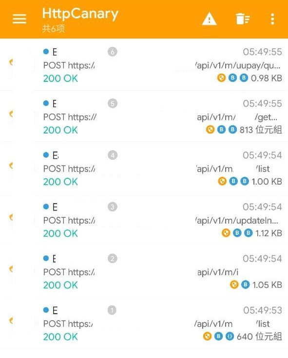

# Introdution
English | [中文](README_tw.md)

Bypass **libcurl** (NDK) SSL-Pinning protection presented in some Android apps.

# Pre-requisites
- Frida access to your mobile device

# Usage
### Spawn mode
```bash
frida -U -f com.example --no-pause -l Frida-libcurlUnpinning.js
```
> `U`: Connect to remote device
  `f`: Spawn specified app
  `--no-pause`: Resume main thread after spawning app
  `l`: Load & run script

### Attach mode **(Recommended)**
```bash
frida -U -F -l Frida-libcurlUnpinning.js
```
> `U`: Connect to remote device
  `F`: Attach to foreground app
  `l`: Load & run script

# Example



# Credits
- [iOS libcurl hooking](https://www.nevermoe.com/2016/05/30/hook-ios%E7%9A%84libcurl/) by @Nevermoe

# Q & A
- Q: How does it work?
- A: It’s just ~~[a balloon stretched over a cup](https://www.youtube.com/watch?v=QRiQXCkw3rs)~~. Jk, it simply hooks curl_easy_setopt and blocks options related to SSL-Pinning.