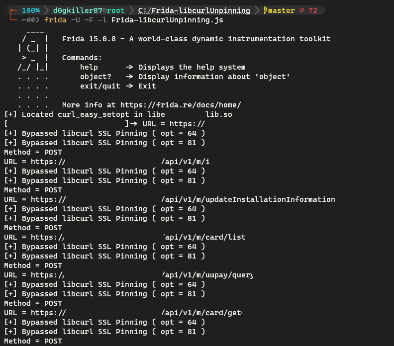
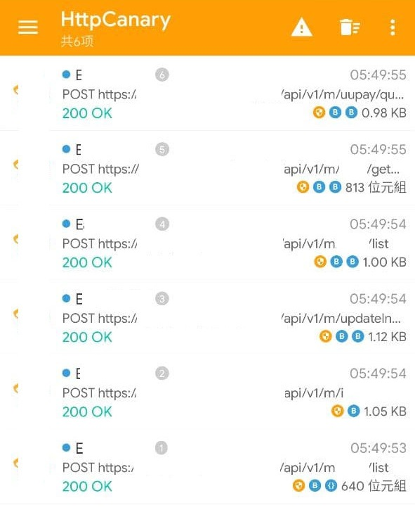

# 簡介
[English](README.md) | 中文

繞過一些 Android app 中使用的 **libcurl** (NDK) 證書固定 (SSL-Pinning) 保護。

# 前置條件
- 您已可透過 Frida 存取移動設備

# 使用方式
### 生成模式
```bash
frida -U -f com.example --no-pause -l Frida-libcurlUnpinning.js
```
> `U`: 連線至遠端設備
  `f`: 生成指定 app
  `--no-pause`: 跳過啟動時暫停
  `l`: 執行指定腳本

### 附加模式 **(推薦)**
```bash
frida -U -F -l Frida-libcurlUnpinning.js
```
> `U`: 連線至遠端設備
  `F`: 附加至最上層 app
  `l`: 執行指定腳本

# 範例



# 銘謝
- [hook iOS的libcurl](https://www.nevermoe.com/2016/05/30/hook-ios%E7%9A%84libcurl/) by @Nevermoe

# Q & A
- Q: 繞過原理是啥?
- A: Hook curl_easy_setopt 函數並去除 SSL-Pinning 的相關參數。